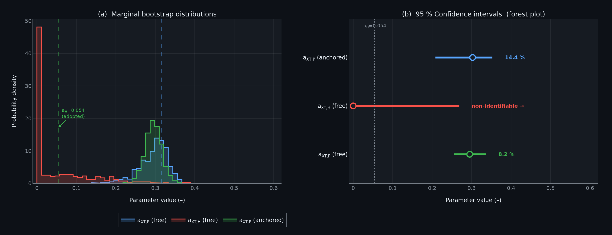

# bootstrap-identifiability

> Parametric bootstrap uncertainty quantification and OAT sensitivity analysis  
> for a hygro-viscoelastic dual-damage model of 3D-printed CF/Onyx composites.



## What this repo does

Implements a Python surrogate of a coupled **Carter–Kibler diffusion + 
Prony-series viscoelasticity + dual-damage** constitutive model, then:

- Runs **n = 1000 parametric bootstrap** resamples on short-term tensile 
  calibration data (0–90 days)
- Quantifies **95 % confidence intervals** on damage parameters `a_P` 
  (plasticisation) and `a_H` (hydrolytic)
- Demonstrates **structural non-identifiability** of `a_H` from short-term 
  data alone (CI spans full admissible range)
- Compares free vs. anchored (`a_H = 0.054`) estimation strategies

## Key result

| Parameter | Strategy | 95 % CI width |
|---|---|---|
| `a_XT,P` | Free | 8.2 % |
| `a_XT,H` | Free | **non-identifiable** |
| `a_XT,P` | Anchored | 14.4 % |

> A model calibrated to < 1.2 % RMSE over 90 days still carries ~22 pp 
> one-year prediction uncertainty — directly relevant to composite pressure 
> vessel certification.

## Dependencies

```bash
pip install numpy scipy plotly kaleido
```

## Files

| File | Description |
|---|---|
| `bootstrap_identifiability.py` | Main script — surrogate + bootstrap + figure |
| `bootstrap_identifiability.png` | Output figure (dual-panel) |

## Part of

MSc thesis: *Coupled Hygro-Viscoelastic Dual-Damage UMAT for 3D-Printed 
CF/Onyx Composites* — LUT University, Finland, 2026.  
Author: **Irfan Irfan** · [irfan.research](https://irfa463.github.io)
